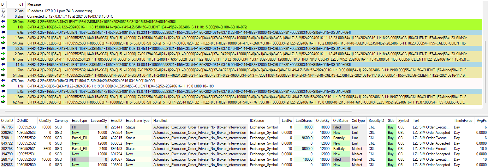

# Introduction

This is a fix simulator using FIX 4.2 protocol built by relying on ChatGPT almost 60%. 
It has some basic functionalities such as responding to login and order requests **(covered 35=D, 35=F and 35G)**
Development is still in progress. However, this simulator is function partially.  

This simulator also comes with a flask application containing several API endpoints. **However, only /fix message/parse_to_json and /send_message is working**. 

# Set Up

Simulator.properties containing list of configured properties. Only below are working

* tag58*
* simulator_comp_id
* fills logic

1. Minimum Python version is 3.9
2. Recommended is 3.12
3. **Oracle Database is required to run this simulator.**
4. You will need to create a user (table space) and grant SELECT, CREATE AND UPDATE query to that user.
5. After that login as that user and crete required table using the DDL attached in this directory.
6. You will need to create db.properties file containing the below items.
7. Change the simulator_comp_id and ensure that your client fix adapter is pointing to the correct one.

* db_username=fixsim
* db_password=fixsim123
* sn=
* sid=XE
* hostname=localhost
* port=1521

# Running the simulator

1. Ensure the below modules are being installed Refer to requirements.txt
2. Start the simulator by using python3 apiservice.py 7418 5031

   7418 is binding port for fix message
   5031 is the port for API request

   Please use one port for one fix session

# Using /send_message
1. You can use this to send fix message to connected client by passing in your desired tags in a json object form

### These tags will be automatically added. Do not include them

1. 49,17,37,52,60,34,10
2. Remember to include 9 with 0 length in your json request body. It will get recalculated again. 

# Known Bugs and Pull Requests are Welcomed
1. Sequence number will be out of sync after some time running the simulator
2. The fix message return from the simulator might not get recognized by your fix adapter / client.
3. No multithreading capability. One port can only serve one comp id

# Working Examples / Tests

### **Order Submissions**

