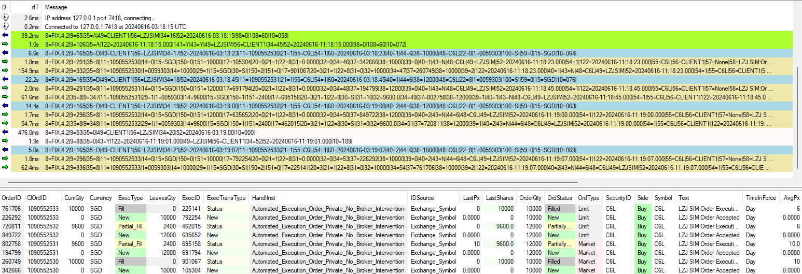

# Fix Simulator

A FIX 4.2 simulator with a Flask backend and a React frontend.

## Project structure

- `backend/` — simulator and API server, Python code, database config, runtime files
- `frontend/ui/` — React + Vite frontend for API-driven UI
- `frontend/legacy_static/` — preserved legacy static UI page

## Prerequisites

- Python 3.9+ (3.12 recommended)
- Node.js 18+ and npm
- Oracle database or another DB for your backend query support

## Backend setup

1. Open a terminal in `backend/`
2. Create or activate the Python environment:

```powershell
cd backend
python -m venv .venv
.\.venv\Scripts\activate
```

3. Install dependencies:

```powershell
pip install -r requirements.txt
```

4. Create `backend/db.properties` if it does not exist, with values like:

```text
db_username=fixsim
db_password=fixsim123
sn=
sid=XE
hostname=localhost
port=1521
```

5. Confirm `backend/simulator.properties` contains the correct simulator settings.
6. Create the required DB table using `backend/DDL.sql`.

## Running the backend

From `backend/`:

```powershell
cd backend
.\.venv\Scripts\activate
python apiservice.py 7418 5031
```

- `7418` is the FIX socket port
- `5031` is the Flask API port

## Frontend setup

1. Open a terminal in `frontend/ui/`
2. Install Node dependencies:

```powershell
cd frontend\ui
npm install
```

3. Start the frontend dev server:

```powershell
npm run dev
```

4. Open the provided Vite URL (usually `http://localhost:5173`).

## Frontend proxy

The React frontend uses Vite proxy configuration in `frontend/ui/vite.config.js` to forward API calls to the backend Flask server at `http://127.0.0.1:5031`.

If you change the Flask port, update the proxy settings accordingly.

## Available UI flows

- Send a custom FIX message using `/send_message`
- Retrieve orders by client comp ID using `/retrieve_orders_by_client_comp_id/<client_comp_id>`
- Right-click any order row in the table to open a context menu:
  - View JSON
  - Copy JSON
  - More actions

## Legacy static UI

The legacy static UI files are preserved under `frontend/legacy_static/`.

## Notes on configuration

- The simulator uses `backend/simulator.properties` and `backend/db.properties`.
- Database integration is implemented in `backend/databaseconnector.py`.
- Order and FIX processing logic lives in `backend/simulator.py` and the `backend/proccess*` modules.

## Known issues

- Sequence number may drift over long sessions
- FIX messages may require adapter-specific adjustments
- Simulator handles one connected client per port

## Example screenshot



